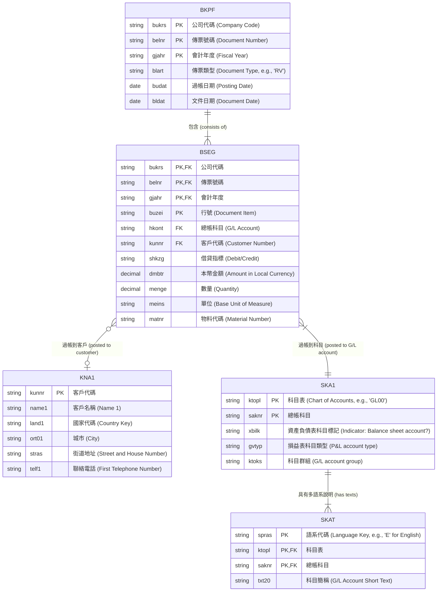
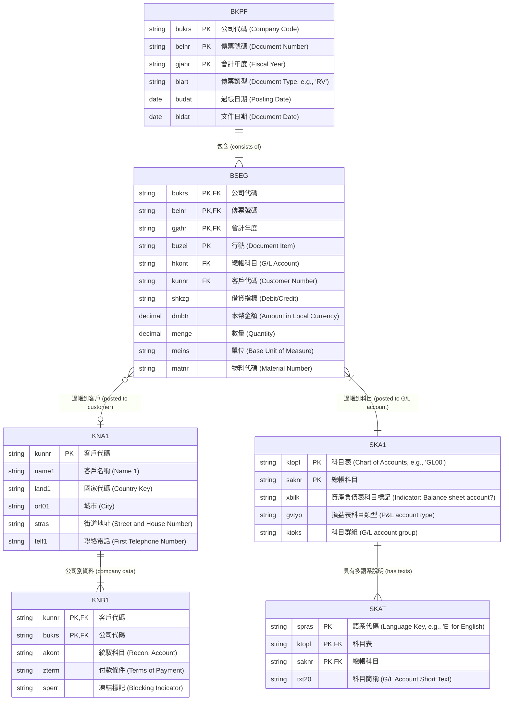

# 正是用mermaid畫的ER Model

## 期中與期末第一題

```mermaid
erDiagram
    %% ==========================================
    %% 1. 交易資料表 (Transaction Data)
    %% ==========================================
    BKPF {
        string bukrs PK "公司代碼 (Company Code)"
        string belnr PK "傳票號碼 (Document Number)"
        string gjahr PK "會計年度 (Fiscal Year)"
        string blart "傳票類型 (Document Type, e.g., 'RV')"
        date budat "過帳日期 (Posting Date)"
        date bldat "文件日期 (Document Date)"
    }

    BSEG {
        string bukrs PK, FK "公司代碼"
        string belnr PK, FK "傳票號碼"
        string gjahr PK, FK "會計年度"
        string buzei PK "行號 (Document Item)"
        string hkont FK "總帳科目 (G/L Account)"
        string kunnr FK "客戶代碼 (Customer Number)"
        string shkzg "借貸指標 (Debit/Credit)"
        decimal dmbtr "本幣金額 (Amount in Local Currency)"
        decimal menge "數量 (Quantity)"
        string meins "單位 (Base Unit of Measure)"
        string matnr "物料代碼 (Material Number)"
    }

    %% ==========================================
    %% 2. 主檔資料表 (Master Data)
    %% ==========================================
    KNA1 {
        string kunnr PK "客戶代碼"
        string name1 "客戶名稱 (Name 1)"
        string land1 "國家代碼 (Country Key)"
        string ort01 "城市 (City)"
        string stras "街道地址 (Street and House Number)"
        string telf1 "聯絡電話 (First Telephone Number)"
    }

    SKA1 {
        string ktopl PK "科目表 (Chart of Accounts, e.g., 'GL00')"
        string saknr PK "總帳科目"
        string xbilk "資產負債表科目標記 (Indicator: Balance sheet account?)"
        string gvtyp "損益表科目類型 (P&L account type)"
        string ktoks "科目群組 (G/L account group)"
    }

    SKAT {
        string spras PK "語系代碼 (Language Key, e.g., 'E' for English)"
        string ktopl PK, FK "科目表"
        string saknr PK, FK "總帳科目"
        string txt20 "科目簡稱 (G/L Account Short Text)"
    }

    %% ==========================================
    %% 3. 實體關聯定義 (Relationships)
    %% ==========================================

    %% 傳票抬頭 與 傳票明細 是父子表關係 (1:N)
    %% 依靠 BUKRS (公司), BELNR (號碼), GJAHR (年度) 串接
    BKPF ||--|{ BSEG : "包含 (consists of)"

    %% 傳票明細 與 客戶主檔 (N:1)
    %% 依靠 KUNNR 串接。並非所有明細行都有客戶，故為選填 (o)
    BSEG }o--o| KNA1 : "過帳到客戶 (posted to customer)"

    %% 傳票明細 與 科目主檔 (N:1)
    %% 依靠 HKONT/SAKNR 串接。所有會計分錄都必須有科目
    BSEG }|--|| SKA1 : "過帳到科目 (posted to G/L account)"

    %% 科目主檔 與 科目說明 (1:N)
    %% 依靠 KTOPL (科目表) 與 SAKNR (科目) 串接。
    %% 一個科目可以有多個語系的說明（例如中文、英文）
    SKA1 ||--|{ SKAT : "具有多語系說明 (has texts)"
```

## 期末第二題

```mermaid
erDiagram
    %% ==========================================
    %% 1. 交易資料表 (Transaction Data)
    %% ==========================================
    BKPF {
        string bukrs PK "公司代碼 (Company Code)"
        string belnr PK "傳票號碼 (Document Number)"
        string gjahr PK "會計年度 (Fiscal Year)"
        string blart "傳票類型 (Document Type, e.g., 'RV')"
        date budat "過帳日期 (Posting Date)"
        date bldat "文件日期 (Document Date)"
    }

    BSEG {
        string bukrs PK, FK "公司代碼"
        string belnr PK, FK "傳票號碼"
        string gjahr PK, FK "會計年度"
        string buzei PK "行號 (Document Item)"
        string hkont FK "總帳科目 (G/L Account)"
        string kunnr FK "客戶代碼 (Customer Number)"
        string shkzg "借貸指標 (Debit/Credit)"
        decimal dmbtr "本幣金額 (Amount in Local Currency)"
        decimal menge "數量 (Quantity)"
        string meins "單位 (Base Unit of Measure)"
        string matnr "物料代碼 (Material Number)"
    }

    %% ==========================================
    %% 2. 主檔資料表 (Master Data)
    %% ==========================================
    KNA1 {
        string kunnr PK "客戶代碼"
        string name1 "客戶名稱 (Name 1)"
        string land1 "國家代碼 (Country Key)"
        string ort01 "城市 (City)"
        string stras "街道地址 (Street and House Number)"
        string telf1 "聯絡電話 (First Telephone Number)"
    }

    KNB1 {
        string kunnr PK, FK "客戶代碼"
        string bukrs PK, FK "公司代碼"
        string akont "統馭科目 (Recon. Account)"
        string zterm "付款條件 (Terms of Payment)"
        string sperr "凍結標記 (Blocking Indicator)"
    }

    SKA1 {
        string ktopl PK "科目表 (Chart of Accounts, e.g., 'GL00')"
        string saknr PK "總帳科目"
        string xbilk "資產負債表科目標記 (Indicator: Balance sheet account?)"
        string gvtyp "損益表科目類型 (P&L account type)"
        string ktoks "科目群組 (G/L account group)"
    }

    SKAT {
        string spras PK "語系代碼 (Language Key, e.g., 'E' for English)"
        string ktopl PK, FK "科目表"
        string saknr PK, FK "總帳科目"
        string txt20 "科目簡稱 (G/L Account Short Text)"
    }

    %% ==========================================
    %% 3. 實體關聯定義 (Relationships)
    %% ==========================================

    %% 傳票抬頭 與 傳票明細 是父子表關係 (1:N)
    BKPF ||--|{ BSEG : "包含 (consists of)"

    %% 傳票明細 與 客戶主檔 (N:1)
    %% 依靠 KUNNR 串接，並非所有明細行都有客戶
    BSEG }o--o| KNA1 : "過帳到客戶 (posted to customer)"

    %% 客戶一般主檔 與 客戶公司別資料 (1:N)
    KNA1 ||--|{ KNB1 : "公司別資料 (company data)"

    %% 傳票明細 與 科目主檔 (N:1)
    BSEG }|--|| SKA1 : "過帳到科目 (posted to G/L account)"

    %% 科目主檔 與 科目說明 (1:N)
    SKA1 ||--|{ SKAT : "具有多語系說明 (has texts)"
```
